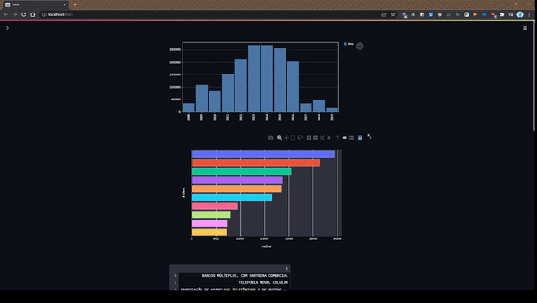

# Dashboard do Cadastro Nacional de Reclamações Fundamentadas
 Dashboard usando dados públicos do Sindec desenvolvido durante o Trabalho de Aplicação de Conhecimento apresentado ao Curso de Pós-Graduação em Ciência de Dados – Big Data Analytics da Universidade Presbiteriana Mackenzie para a obtenção do título de Especialista em Ciência de Dados – Big Data Analytics.  

Contém dados públicos referentes ao Cadastro Nacional de Reclamações Fundamentadas disponíveis em: https://dados.gov.br/dataset/cadastro-nacional-de-reclamacoes-fundamentadas-procons-sindec1

